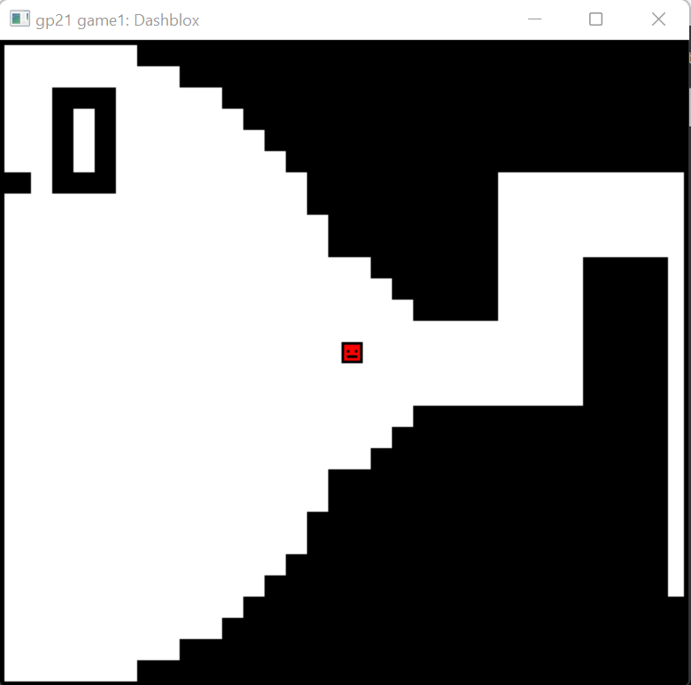

# Dashblox

Author: Lawrence Chen

Design: An infinite sidescroller where the goal is to stay within the window and survive as long as possible. I took inspiration from the flash game called "The World's Hardest Game", and changed it so that there is a sprinting functionality and making it infinite.

Screen Shot:

How Your Asset Pipeline Works:

For obstacles: I draw a 32x30 sprite on piskelapp.com. Black pixels represent walls and white pixels represent empty space. I save this as a png in dist/data/obstacles. The first obstacle that is encountered will always be the same, and is saved as dist/data/start.png.
For the player: I draw a 8x8 sprite on piskelapp.com, making sure it uses at most 4 colors. I save this as dist/data/player.png.

Once these pngs are in place, I run dist/data/preprocess.py to get it into a better format. The obstacles are joined into a single file (processed_obstacles.dat) that contains space-separated 0's and 1's describing each obstacle. The player sprite is placed in processed_player.dat, which contains the 4 colors in the color palette as well as an 8x8 array with the color indices. Since I have not run into any space/performance issues, these are stored in plaintext for simplicity.

How To Play:

Use arrow keys to move. Spacebar to sprint. The objective is to move to the right, staying within the window, and survive as long as possible without bumping into the black tiles. If you die (either by hitting a black tile or the edge of the window), you can restart by pressing 'r'.

This game was built with [NEST](NEST.md).

